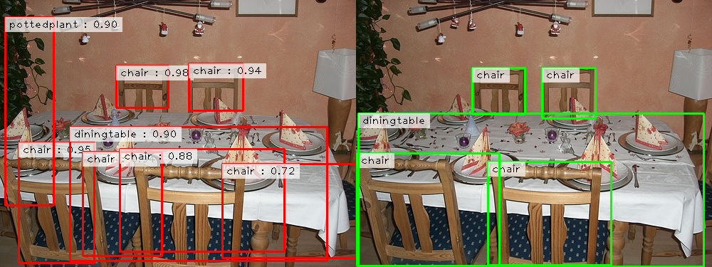
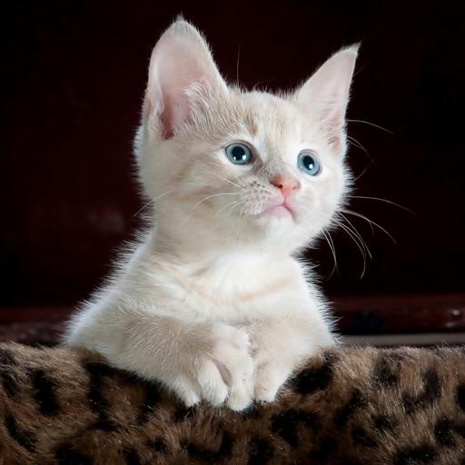

# Faster-RCNN from scratch

## Download Pascal VOC dataset

```bash
mkdir -p ./data

curl -L -o VOCtrainval_06-Nov-2007.tar http://host.robots.ox.ac.uk/pascal/VOC/voc2007/VOCtrainval_06-Nov-2007.tar
tar -xf VOCtrainval_06-Nov-2007.tar
mv VOCdevkit/VOC2007 ./data/VOC2007

curl -L -o VOCtest_06-Nov-2007.tar http://host.robots.ox.ac.uk/pascal/VOC/voc2007/VOCtest_06-Nov-2007.tar
tar -xf VOCtest_06-Nov-2007.tar
mv VOCdevkit/VOC2007 ./data/VOC2007-test

rm -rf VOCdevkit
rm VOCtrainval_06-Nov-2007.tar
rm VOCtest_06-Nov-2007.tar
```

## `train.py`

Faster R-CNN 모델 training code.

**Usage:**

```bash
uv run train.py
```

**Result:**

```bash
{0: 'background', 1: 'aeroplane', 2: 'bicycle', 3: 'bird', 4: 'boat', 5: 'bottle', 6: 'bus', 7: 'car', 8: 'cat', 9: 'chair', 10: 'cow', 11: 'diningtable', 12: 'dog', 13: 'horse', 14: 'motorbike', 15: 'person', 16: 'pottedplant', 17: 'sheep', 18: 'sofa', 19: 'train', 20: 'tvmonitor'}
100%|██████████| 5011/5011 [00:00<00:00, 20652.80it/s]
Total 5011 images found
100%|██████████| 5011/5011 [03:25<00:00, 24.33it/s]
Finished epoch 0
RPN Classification Loss : 0.2976 | RPN Localization Loss : 0.1342 | FRCNN Classification Loss : 0.4348 | FRCNN Localization Loss : 0.0865
...
100%|██████████| 5011/5011 [03:28<00:00, 24.01it/s]
Finished epoch 9
RPN Classification Loss : 0.1091 | RPN Localization Loss : 0.0939 | FRCNN Classification Loss : 0.1637 | FRCNN Localization Loss : 0.0542
Done Training...
```
## `train_torchvision.py`

pretrain된 torchvision의 모델(fasterrcnn_resnet50_fpn) voc에 finetuning

**Usage:**

```bash
uv run train_torchvision.py
```

**Result:**

```bash
{0: 'background', 1: 'aeroplane', 2: 'bicycle', 3: 'bird', 4: 'boat', 5: 'bottle', 6: 'bus', 7: 'car', 8: 'cat', 9: 'chair', 10: 'cow', 11: 'diningtable', 12: 'dog', 13: 'horse', 14: 'motorbike', 15: 'person', 16: 'pottedplant', 17: 'sheep', 18: 'sofa', 19: 'train', 20: 'tvmonitor'}
100%|██████████| 5011/5011 [00:00<00:00, 6697.96it/s]
Total 5011 images found
100%|██████████| 1253/1253 [03:51<00:00,  5.41it/s]
Finished epoch 0
RPN Classification Loss : 0.0158 | RPN Localization Loss : 0.0096 | FRCNN Classification Loss : 0.4592 | FRCNN Localization Loss : 0.2462
...
100%|██████████| 1253/1253 [03:51<00:00,  5.42it/s]
Finished epoch 9
RPN Classification Loss : 0.0029 | RPN Localization Loss : 0.0062 | FRCNN Classification Loss : 0.1757 | FRCNN Localization Loss : 0.1103
Done Training...
```

## `inference.py`

Faster R-CNN 모델 inference code. \
학습한 custom model과 torchvision에서 불러온 모델 사용 가능

**Usage:** 

`--infer`: custom model로 sample image에 inference 실행
```bash
uv run inference.py --infer
```

`--eval`: custom model로 test set에 mAP 평가
```bash
uv run inference.py --eval 
```

`--torchvision`: torchvision model로 sample image에 inference 실행
```bash
uv run inference.py --torchvision 
```

`--image_path`: custom model로 단일 이미지 inference
```bash
uv run inference.py --image_path ./image.jpg 
```

`--image_path_torchvision`: torchvision model로 단일 이미지 inference
```bash
uv run inference.py --image_path_torchvision ./image.jpg 
```

**Results:**

```bash
Class Wise Average Precisions
AP for class background = nan
AP for class aeroplane = 0.5941
AP for class bicycle = 0.6387
AP for class bird = 0.4833
AP for class boat = 0.3377
AP for class bottle = 0.3331
AP for class bus = 0.5844
AP for class car = 0.6408
AP for class cat = 0.7009
AP for class chair = 0.3375
AP for class cow = 0.5693
AP for class diningtable = 0.4825
AP for class dog = 0.6202
AP for class horse = 0.5870
AP for class motorbike = 0.6666
AP for class person = 0.6384
AP for class pottedplant = 0.3010
AP for class sheep = 0.4786
AP for class sofa = 0.4817
AP for class train = 0.6756
AP for class tvmonitor = 0.6034
Mean Average Precision : 0.5377
```
**comparison - custom model**



**comparison - torchvision model**


**original image**




**predicted image - custom model**


**predicted image - torchvision model**


